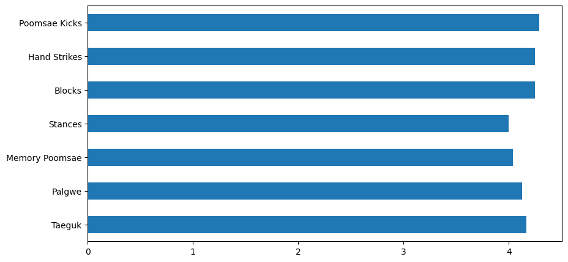
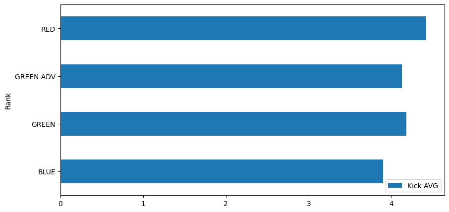

# Advanced Belt Test Cleaning and Exploration

## Importing Pandas, Data, and OS


```python
import pandas as pd
import os

df = pd.read_excel(r"C:\Users\k4leu\OneDrive\Documents\BELT TESTING DATA\Sparta Belt Test 3_25.xlsx", sheet_name ='Advanced')
df.groupby('Rank')
df 
```


<div>
<style scoped>
    .dataframe tbody tr th:only-of-type {
        vertical-align: middle;
    }

    .dataframe tbody tr th {
        vertical-align: top;
    }

    .dataframe thead th {
        text-align: right;
    }
</style>
<table border="1" class="dataframe">
  <thead>
    <tr style="text-align: right;">
      <th></th>
      <th>Student ID</th>
      <th>Class</th>
      <th>Rank</th>
      <th>Taeguk</th>
      <th>Palgwe</th>
      <th>Memory Poomsae</th>
      <th>Stances</th>
      <th>Blocks</th>
      <th>Hand Strikes</th>
      <th>Poomsae Kicks</th>
      <th>Kick AVG</th>
      <th>Breaking</th>
      <th>Sparring</th>
      <th>Questions</th>
    </tr>
  </thead>
  <tbody>
    <tr>
      <th>0</th>
      <td>3650</td>
      <td>JR</td>
      <td>GREEN</td>
      <td>3.5</td>
      <td>4.0</td>
      <td>3.5</td>
      <td>3.5</td>
      <td>3.5</td>
      <td>3.0</td>
      <td>3.5</td>
      <td>3.250000</td>
      <td>4.0</td>
      <td>3.5</td>
      <td>4</td>
    </tr>
    <tr>
      <th>1</th>
      <td>8140</td>
      <td>JR</td>
      <td>GREEN</td>
      <td>2.0</td>
      <td>2.0</td>
      <td>1.0</td>
      <td>2.0</td>
      <td>3.0</td>
      <td>3.0</td>
      <td>3.0</td>
      <td>3.375000</td>
      <td>3.0</td>
      <td>4.0</td>
      <td>4</td>
    </tr>
    <tr>
      <th>2</th>
      <td>4224</td>
      <td>JR</td>
      <td>GREEN</td>
      <td>4.5</td>
      <td>4.5</td>
      <td>5.0</td>
      <td>4.5</td>
      <td>5.0</td>
      <td>5.0</td>
      <td>5.0</td>
      <td>5.000000</td>
      <td>5.0</td>
      <td>4.5</td>
      <td>5</td>
    </tr>
    <tr>
      <th>3</th>
      <td>1061</td>
      <td>ADULT</td>
      <td>GREEN</td>
      <td>4.5</td>
      <td>5.0</td>
      <td>4.5</td>
      <td>5.0</td>
      <td>5.0</td>
      <td>4.5</td>
      <td>5.0</td>
      <td>4.750000</td>
      <td>5.0</td>
      <td>5.0</td>
      <td>5</td>
    </tr>
    <tr>
      <th>4</th>
      <td>1107</td>
      <td>JR</td>
      <td>GREEN</td>
      <td>4.5</td>
      <td>4.5</td>
      <td>5.0</td>
      <td>4.5</td>
      <td>5.0</td>
      <td>5.0</td>
      <td>5.0</td>
      <td>4.875000</td>
      <td>4.5</td>
      <td>5.0</td>
      <td>5</td>
    </tr>
    <tr>
      <th>5</th>
      <td>5386</td>
      <td>JR</td>
      <td>GREEN</td>
      <td>4.5</td>
      <td>4.0</td>
      <td>4.0</td>
      <td>3.5</td>
      <td>4.0</td>
      <td>4.5</td>
      <td>4.5</td>
      <td>4.125000</td>
      <td>5.0</td>
      <td>5.0</td>
      <td>5</td>
    </tr>
    <tr>
      <th>6</th>
      <td>9900</td>
      <td>JR</td>
      <td>GREEN</td>
      <td>4.5</td>
      <td>4.5</td>
      <td>4.5</td>
      <td>4.0</td>
      <td>4.5</td>
      <td>4.0</td>
      <td>4.5</td>
      <td>3.875000</td>
      <td>4.5</td>
      <td>5.0</td>
      <td>5</td>
    </tr>
    <tr>
      <th>7</th>
      <td>2456</td>
      <td>ADULT</td>
      <td>GREEN ADV</td>
      <td>4.0</td>
      <td>4.0</td>
      <td>4.0</td>
      <td>4.0</td>
      <td>4.0</td>
      <td>4.0</td>
      <td>4.0</td>
      <td>3.750000</td>
      <td>4.5</td>
      <td>4.0</td>
      <td>5</td>
    </tr>
    <tr>
      <th>8</th>
      <td>1739</td>
      <td>ADULT</td>
      <td>GREEN ADV</td>
      <td>5.0</td>
      <td>5.0</td>
      <td>4.5</td>
      <td>4.5</td>
      <td>5.0</td>
      <td>5.0</td>
      <td>4.5</td>
      <td>4.500000</td>
      <td>5.0</td>
      <td>5.0</td>
      <td>5</td>
    </tr>
    <tr>
      <th>9</th>
      <td>6252</td>
      <td>JR</td>
      <td>BLUE</td>
      <td>4.0</td>
      <td>4.0</td>
      <td>4.0</td>
      <td>4.0</td>
      <td>4.0</td>
      <td>4.5</td>
      <td>4.0</td>
      <td>3.900000</td>
      <td>5.0</td>
      <td>4.5</td>
      <td>5</td>
    </tr>
    <tr>
      <th>10</th>
      <td>199</td>
      <td>ADULT</td>
      <td>RED</td>
      <td>5.0</td>
      <td>4.5</td>
      <td>4.5</td>
      <td>4.5</td>
      <td>4.5</td>
      <td>4.5</td>
      <td>5.0</td>
      <td>4.500000</td>
      <td>3.5</td>
      <td>5.0</td>
      <td>5</td>
    </tr>
    <tr>
      <th>11</th>
      <td>41862</td>
      <td>ADULT</td>
      <td>RED</td>
      <td>4.0</td>
      <td>3.5</td>
      <td>4.0</td>
      <td>NaN</td>
      <td>3.5</td>
      <td>4.0</td>
      <td>3.5</td>
      <td>4.333333</td>
      <td>4.0</td>
      <td>5.0</td>
      <td>5</td>
    </tr>
  </tbody>
</table>
</div>


## Getting Data Info


```python
df.info()
```

    <class 'pandas.core.frame.DataFrame'>
    RangeIndex: 12 entries, 0 to 11
    Data columns (total 14 columns):
     #   Column          Non-Null Count  Dtype  
    ---  ------          --------------  -----  
     0   Student ID      12 non-null     int64  
     1   Class           12 non-null     object 
     2   Rank            12 non-null     object 
     3   Taeguk          12 non-null     float64
     4   Palgwe          12 non-null     float64
     5   Memory Poomsae  12 non-null     float64
     6   Stances         11 non-null     float64
     7   Blocks          12 non-null     float64
     8   Hand Strikes    12 non-null     float64
     9   Poomsae Kicks   12 non-null     float64
     10  Kick AVG        12 non-null     float64
     11  Breaking        12 non-null     float64
     12  Sparring        12 non-null     float64
     13  Questions       12 non-null     int64  
    dtypes: float64(10), int64(2), object(2)
    memory usage: 1.4+ KB
    

## Initial Data Statistics


```python
df.describe()
```


<div>
<style scoped>
    .dataframe tbody tr th:only-of-type {
        vertical-align: middle;
    }

    .dataframe tbody tr th {
        vertical-align: top;
    }

    .dataframe thead th {
        text-align: right;
    }
</style>
<table border="1" class="dataframe">
  <thead>
    <tr style="text-align: right;">
      <th></th>
      <th>Student ID</th>
      <th>Taeguk</th>
      <th>Palgwe</th>
      <th>Memory Poomsae</th>
      <th>Stances</th>
      <th>Blocks</th>
      <th>Hand Strikes</th>
      <th>Poomsae Kicks</th>
      <th>Kick AVG</th>
      <th>Breaking</th>
      <th>Sparring</th>
      <th>Questions</th>
    </tr>
  </thead>
  <tbody>
    <tr>
      <th>count</th>
      <td>12.000000</td>
      <td>12.000000</td>
      <td>12.000000</td>
      <td>12.000000</td>
      <td>11.000000</td>
      <td>12.000000</td>
      <td>12.000000</td>
      <td>12.000000</td>
      <td>12.000000</td>
      <td>12.000000</td>
      <td>12.000000</td>
      <td>12.000000</td>
    </tr>
    <tr>
      <th>mean</th>
      <td>7164.666667</td>
      <td>4.166667</td>
      <td>4.125000</td>
      <td>4.041667</td>
      <td>4.000000</td>
      <td>4.250000</td>
      <td>4.250000</td>
      <td>4.291667</td>
      <td>4.186111</td>
      <td>4.416667</td>
      <td>4.625000</td>
      <td>4.833333</td>
    </tr>
    <tr>
      <th>std</th>
      <td>11327.421542</td>
      <td>0.807165</td>
      <td>0.801277</td>
      <td>1.054392</td>
      <td>0.806226</td>
      <td>0.690849</td>
      <td>0.690849</td>
      <td>0.689477</td>
      <td>0.570523</td>
      <td>0.668558</td>
      <td>0.527645</td>
      <td>0.389249</td>
    </tr>
    <tr>
      <th>min</th>
      <td>199.000000</td>
      <td>2.000000</td>
      <td>2.000000</td>
      <td>1.000000</td>
      <td>2.000000</td>
      <td>3.000000</td>
      <td>3.000000</td>
      <td>3.000000</td>
      <td>3.250000</td>
      <td>3.000000</td>
      <td>3.500000</td>
      <td>4.000000</td>
    </tr>
    <tr>
      <th>25%</th>
      <td>1581.000000</td>
      <td>4.000000</td>
      <td>4.000000</td>
      <td>4.000000</td>
      <td>3.750000</td>
      <td>3.875000</td>
      <td>4.000000</td>
      <td>3.875000</td>
      <td>3.843750</td>
      <td>4.000000</td>
      <td>4.375000</td>
      <td>5.000000</td>
    </tr>
    <tr>
      <th>50%</th>
      <td>3937.000000</td>
      <td>4.500000</td>
      <td>4.250000</td>
      <td>4.250000</td>
      <td>4.000000</td>
      <td>4.250000</td>
      <td>4.500000</td>
      <td>4.500000</td>
      <td>4.229167</td>
      <td>4.500000</td>
      <td>5.000000</td>
      <td>5.000000</td>
    </tr>
    <tr>
      <th>75%</th>
      <td>6724.000000</td>
      <td>4.500000</td>
      <td>4.500000</td>
      <td>4.500000</td>
      <td>4.500000</td>
      <td>5.000000</td>
      <td>4.625000</td>
      <td>5.000000</td>
      <td>4.562500</td>
      <td>5.000000</td>
      <td>5.000000</td>
      <td>5.000000</td>
    </tr>
    <tr>
      <th>max</th>
      <td>41862.000000</td>
      <td>5.000000</td>
      <td>5.000000</td>
      <td>5.000000</td>
      <td>5.000000</td>
      <td>5.000000</td>
      <td>5.000000</td>
      <td>5.000000</td>
      <td>5.000000</td>
      <td>5.000000</td>
      <td>5.000000</td>
      <td>5.000000</td>
    </tr>
  </tbody>
</table>
</div>


## Getting All Columns to Create Sub Data Frames for Poomsae and Kicks


```python
print(df.columns)
```

    Index(['Student ID', 'Class', 'Rank', 'Taeguk', 'Palgwe', 'Memory Poomsae',
           'Stances', 'Blocks', 'Hand Strikes', 'Poomsae Kicks', 'Kick AVG',
           'Breaking', 'Sparring', 'Questions'],
          dtype='object')
    

## Creating Poomsae Data Frame


```python
adv_psae = df[[ 'Class', 'Rank', 'Taeguk', 'Palgwe', 'Memory Poomsae',
       'Stances', 'Blocks', 'Hand Strikes', 'Poomsae Kicks']]
adv_psae
```


<div>
<style scoped>
    .dataframe tbody tr th:only-of-type {
        vertical-align: middle;
    }

    .dataframe tbody tr th {
        vertical-align: top;
    }

    .dataframe thead th {
        text-align: right;
    }
</style>
<table border="1" class="dataframe">
  <thead>
    <tr style="text-align: right;">
      <th></th>
      <th>Class</th>
      <th>Rank</th>
      <th>Taeguk</th>
      <th>Palgwe</th>
      <th>Memory Poomsae</th>
      <th>Stances</th>
      <th>Blocks</th>
      <th>Hand Strikes</th>
      <th>Poomsae Kicks</th>
    </tr>
  </thead>
  <tbody>
    <tr>
      <th>0</th>
      <td>JR</td>
      <td>GREEN</td>
      <td>3.5</td>
      <td>4.0</td>
      <td>3.5</td>
      <td>3.5</td>
      <td>3.5</td>
      <td>3.0</td>
      <td>3.5</td>
    </tr>
    <tr>
      <th>1</th>
      <td>JR</td>
      <td>GREEN</td>
      <td>2.0</td>
      <td>2.0</td>
      <td>1.0</td>
      <td>2.0</td>
      <td>3.0</td>
      <td>3.0</td>
      <td>3.0</td>
    </tr>
    <tr>
      <th>2</th>
      <td>JR</td>
      <td>GREEN</td>
      <td>4.5</td>
      <td>4.5</td>
      <td>5.0</td>
      <td>4.5</td>
      <td>5.0</td>
      <td>5.0</td>
      <td>5.0</td>
    </tr>
    <tr>
      <th>3</th>
      <td>ADULT</td>
      <td>GREEN</td>
      <td>4.5</td>
      <td>5.0</td>
      <td>4.5</td>
      <td>5.0</td>
      <td>5.0</td>
      <td>4.5</td>
      <td>5.0</td>
    </tr>
    <tr>
      <th>4</th>
      <td>JR</td>
      <td>GREEN</td>
      <td>4.5</td>
      <td>4.5</td>
      <td>5.0</td>
      <td>4.5</td>
      <td>5.0</td>
      <td>5.0</td>
      <td>5.0</td>
    </tr>
    <tr>
      <th>5</th>
      <td>JR</td>
      <td>GREEN</td>
      <td>4.5</td>
      <td>4.0</td>
      <td>4.0</td>
      <td>3.5</td>
      <td>4.0</td>
      <td>4.5</td>
      <td>4.5</td>
    </tr>
    <tr>
      <th>6</th>
      <td>JR</td>
      <td>GREEN</td>
      <td>4.5</td>
      <td>4.5</td>
      <td>4.5</td>
      <td>4.0</td>
      <td>4.5</td>
      <td>4.0</td>
      <td>4.5</td>
    </tr>
    <tr>
      <th>7</th>
      <td>ADULT</td>
      <td>GREEN ADV</td>
      <td>4.0</td>
      <td>4.0</td>
      <td>4.0</td>
      <td>4.0</td>
      <td>4.0</td>
      <td>4.0</td>
      <td>4.0</td>
    </tr>
    <tr>
      <th>8</th>
      <td>ADULT</td>
      <td>GREEN ADV</td>
      <td>5.0</td>
      <td>5.0</td>
      <td>4.5</td>
      <td>4.5</td>
      <td>5.0</td>
      <td>5.0</td>
      <td>4.5</td>
    </tr>
    <tr>
      <th>9</th>
      <td>JR</td>
      <td>BLUE</td>
      <td>4.0</td>
      <td>4.0</td>
      <td>4.0</td>
      <td>4.0</td>
      <td>4.0</td>
      <td>4.5</td>
      <td>4.0</td>
    </tr>
    <tr>
      <th>10</th>
      <td>ADULT</td>
      <td>RED</td>
      <td>5.0</td>
      <td>4.5</td>
      <td>4.5</td>
      <td>4.5</td>
      <td>4.5</td>
      <td>4.5</td>
      <td>5.0</td>
    </tr>
    <tr>
      <th>11</th>
      <td>ADULT</td>
      <td>RED</td>
      <td>4.0</td>
      <td>3.5</td>
      <td>4.0</td>
      <td>NaN</td>
      <td>3.5</td>
      <td>4.0</td>
      <td>3.5</td>
    </tr>
  </tbody>
</table>
</div>


## Creating Data Frame for all Poomsae Means


```python
adv_psae_means = adv_psae.mean()
adv_psae_means
```

    C:\Users\k4leu\AppData\Local\Temp\ipykernel_92308\2240168695.py:1: FutureWarning: The default value of numeric_only in DataFrame.mean is deprecated. In a future version, it will default to False. In addition, specifying 'numeric_only=None' is deprecated. Select only valid columns or specify the value of numeric_only to silence this warning.
      adv_psae_means = adv_psae.mean()
    


    Taeguk            4.166667
    Palgwe            4.125000
    Memory Poomsae    4.041667
    Stances           4.000000
    Blocks            4.250000
    Hand Strikes      4.250000
    Poomsae Kicks     4.291667
    dtype: float64


## Column Chart for all Average Poomsae Scores


```python
adv_psae_means.plot(kind='barh',figsize= (10,5))
```


    <Axes: >


    

    


## Grouping Belt Ranks to find Kicking Means


```python
df.groupby('Rank').mean()
```

    C:\Users\k4leu\AppData\Local\Temp\ipykernel_92308\142718970.py:1: FutureWarning: The default value of numeric_only in DataFrameGroupBy.mean is deprecated. In a future version, numeric_only will default to False. Either specify numeric_only or select only columns which should be valid for the function.
      df.groupby('Rank').mean()
    


<div>
<style scoped>
    .dataframe tbody tr th:only-of-type {
        vertical-align: middle;
    }

    .dataframe tbody tr th {
        vertical-align: top;
    }

    .dataframe thead th {
        text-align: right;
    }
</style>
<table border="1" class="dataframe">
  <thead>
    <tr style="text-align: right;">
      <th></th>
      <th>Student ID</th>
      <th>Taeguk</th>
      <th>Palgwe</th>
      <th>Memory Poomsae</th>
      <th>Stances</th>
      <th>Blocks</th>
      <th>Hand Strikes</th>
      <th>Poomsae Kicks</th>
      <th>Kick AVG</th>
      <th>Breaking</th>
      <th>Sparring</th>
      <th>Questions</th>
    </tr>
    <tr>
      <th>Rank</th>
      <th></th>
      <th></th>
      <th></th>
      <th></th>
      <th></th>
      <th></th>
      <th></th>
      <th></th>
      <th></th>
      <th></th>
      <th></th>
      <th></th>
    </tr>
  </thead>
  <tbody>
    <tr>
      <th>BLUE</th>
      <td>6252.000000</td>
      <td>4.0</td>
      <td>4.000000</td>
      <td>4.000000</td>
      <td>4.000000</td>
      <td>4.000000</td>
      <td>4.500000</td>
      <td>4.000000</td>
      <td>3.900000</td>
      <td>5.000000</td>
      <td>4.500000</td>
      <td>5.000000</td>
    </tr>
    <tr>
      <th>GREEN</th>
      <td>4781.142857</td>
      <td>4.0</td>
      <td>4.071429</td>
      <td>3.928571</td>
      <td>3.857143</td>
      <td>4.285714</td>
      <td>4.142857</td>
      <td>4.357143</td>
      <td>4.178571</td>
      <td>4.428571</td>
      <td>4.571429</td>
      <td>4.714286</td>
    </tr>
    <tr>
      <th>GREEN ADV</th>
      <td>2097.500000</td>
      <td>4.5</td>
      <td>4.500000</td>
      <td>4.250000</td>
      <td>4.250000</td>
      <td>4.500000</td>
      <td>4.500000</td>
      <td>4.250000</td>
      <td>4.125000</td>
      <td>4.750000</td>
      <td>4.500000</td>
      <td>5.000000</td>
    </tr>
    <tr>
      <th>RED</th>
      <td>21030.500000</td>
      <td>4.5</td>
      <td>4.000000</td>
      <td>4.250000</td>
      <td>4.500000</td>
      <td>4.000000</td>
      <td>4.250000</td>
      <td>4.250000</td>
      <td>4.416667</td>
      <td>3.750000</td>
      <td>5.000000</td>
      <td>5.000000</td>
    </tr>
  </tbody>
</table>
</div>


## Creating a Data Frame of Rank and Kick AVG for Each Belt


```python
kick_avr = df[['Rank','Kick AVG']]
adv_kick_means = kick_avr.groupby('Rank').mean()
adv_kick_means
```


<div>
<style scoped>
    .dataframe tbody tr th:only-of-type {
        vertical-align: middle;
    }

    .dataframe tbody tr th {
        vertical-align: top;
    }

    .dataframe thead th {
        text-align: right;
    }
</style>
<table border="1" class="dataframe">
  <thead>
    <tr style="text-align: right;">
      <th></th>
      <th>Kick AVG</th>
    </tr>
    <tr>
      <th>Rank</th>
      <th></th>
    </tr>
  </thead>
  <tbody>
    <tr>
      <th>BLUE</th>
      <td>3.900000</td>
    </tr>
    <tr>
      <th>GREEN</th>
      <td>4.178571</td>
    </tr>
    <tr>
      <th>GREEN ADV</th>
      <td>4.125000</td>
    </tr>
    <tr>
      <th>RED</th>
      <td>4.416667</td>
    </tr>
  </tbody>
</table>
</div>


## Graphing Kick Score Per Rank


```python
adv_kick_means.plot(kind='barh',figsize= (10,5))
```


    <Axes: ylabel='Rank'>


    

    


## Exporting New Data Frames to Microsoft Excel


```python
path = os.path.join(os.path.expanduser("~"), "Documents", r"C:\Users\k4leu\OneDrive\Documents\BELT TESTING DATA")
adv_kick_means.to_csv(os.path.join(path, 'adv_kick_means.csv'), index = True)

path = os.path.join(os.path.expanduser("~"), "Documents", r"C:\Users\k4leu\OneDrive\Documents\BELT TESTING DATA")
adv_psae_means.to_csv(os.path.join(path, 'adv_psae_means.csv'), index = True)
```

### Used Data to create a Dashboard in Tableau for Student Performance


```python

```
